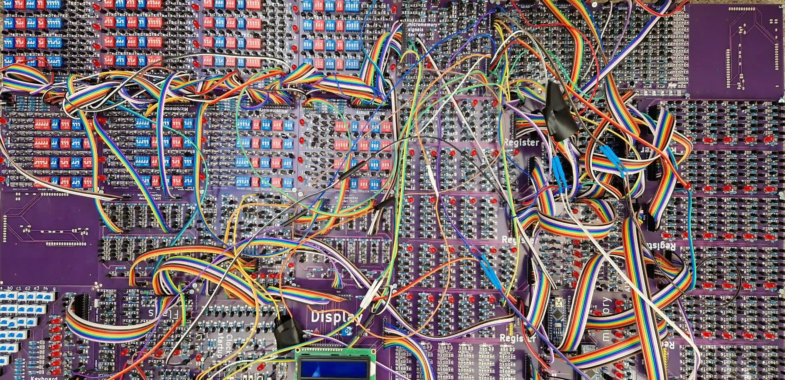

# 2000 MOSFET processor

The project is made in Kicad. If you want to learn more about it visit [howcpuworks.com](howcpuworks.com).

## Conventions
- all transistors on a board point into the same direction (or 2 perpendicular ones if needed)
- all leds point into the same direction
- 1k resistors are labeled with white rectangle, 1M with empty one (only violation is in the Clock board and two voltage divider resistors in LCD board)
- "*" means high significance bits
- "+" means positive 5V

## Tips
- you dont need to use extra usb for the power, powering through arduino is enough
- Adder is made out of 2 smaller 6 bit adders, this means that you do not have to solder one bit (6+6=12 != 11)
- instruction register needs only 5bits which means you do not have to solder upper 6 bits (all registers are the same board to lower costs)
- when soldering
  - first put resistors
  - than transistors from the top left (top right if left handed)
  - leds and pin headers last

## Important
- to lower costs all registers have the same board, but TMP and IR registers do not have input and output connected to the bus, this means you have to connect it on other registers
- You need to find the voltage that works for your LCD contrast and put those resistors

## Components
- 2N7000 MOSFETs
- BC547 (BJT) only 4 for the astable
- 1000 ohm registers for leds
- 1M ohm for logic

## Bugs

While I could fix the bugs I do not want to check is everything working again because I would need to solder things again. This is why I list them, so you can either fix them yourselves before or after soldering (I did after).
Some bugs are just layout bugs, which means you need to be aware of them but not necessarily fix them.

Micromemory:
- shuffled by row led, select and switches - layout bug
- 0th line not connected to rest

Micromemory stepper:
- shuffeled LED state order - layout bug
- add delay from clock to it (for example RC)
   
Keyboard
- same signals for simetrical (with respect to keyboard diagonal) switches
  - effectively half the number of switches
- 1 bit not connected
  
Flags
- second to last carry and last carry labels mixed - layout bug
- flags selector selects 0 always

Clock
- manual clock does not have a debouncer

ALU
- add OR between ALU decoded ops and give Adder the output
